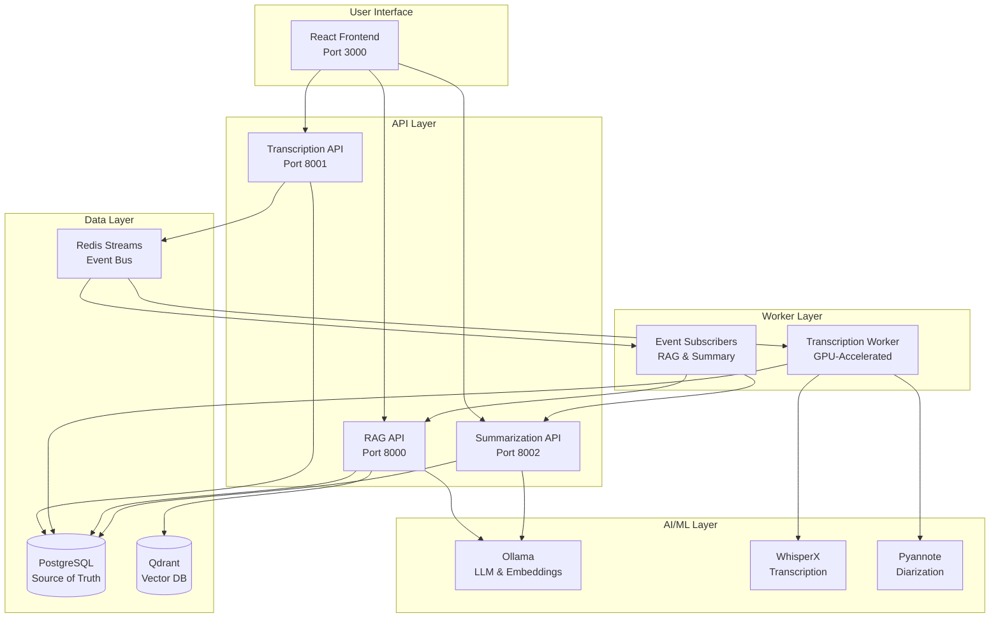
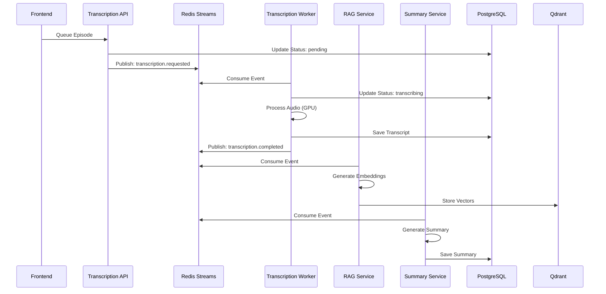
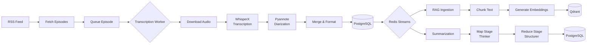
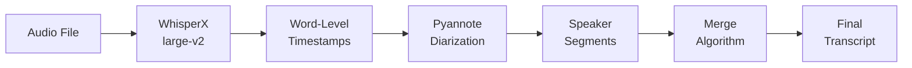
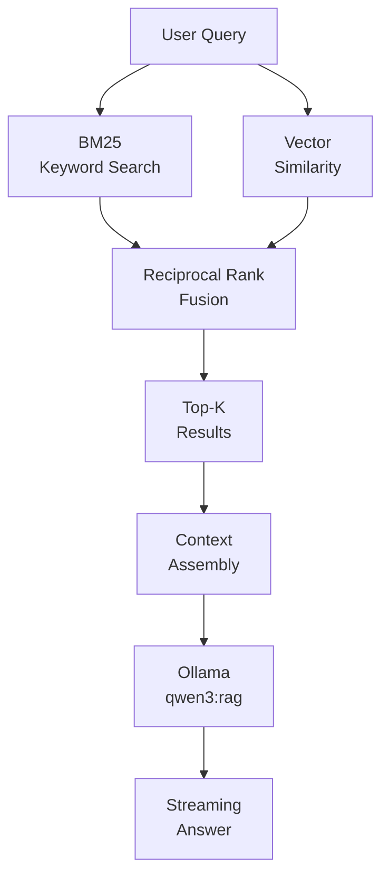
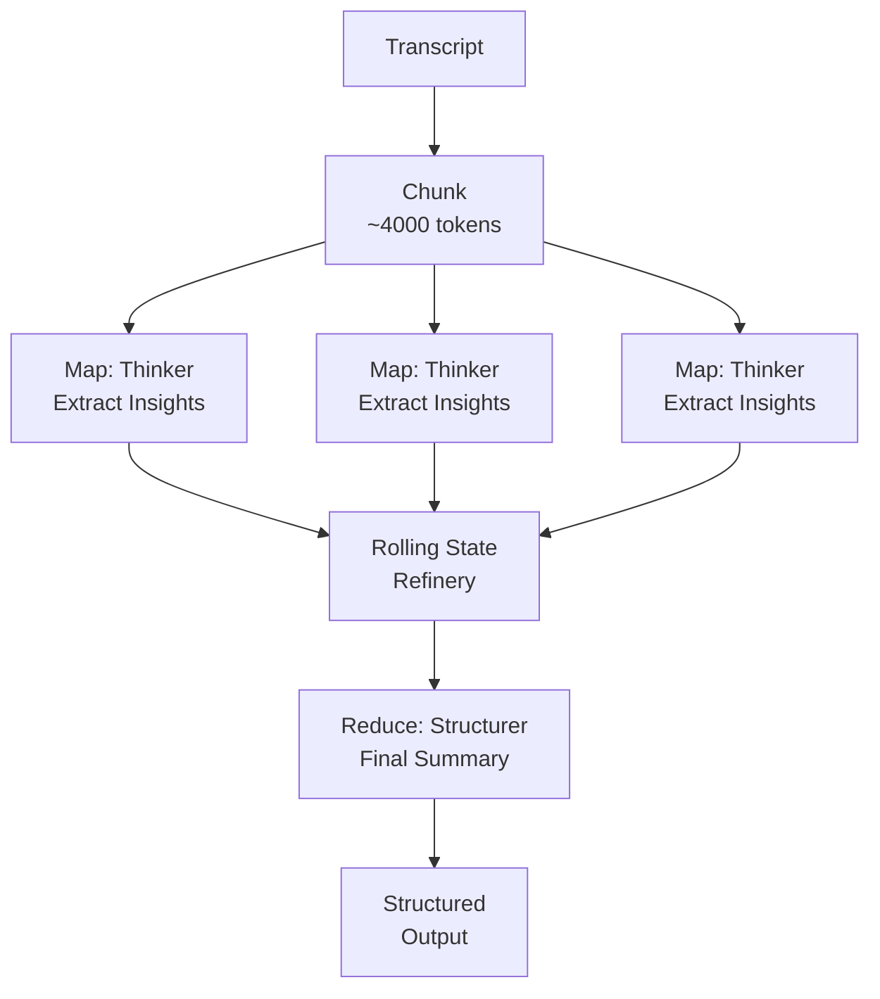

# System Architecture

A comprehensive technical deep-dive into the podcast transcription and RAG system architecture.

## 📋 Table of Contents

- [System Overview](#system-overview)
- [Microservices Architecture](#microservices-architecture)
- [Data Flow](#data-flow)
- [Event-Driven Architecture](#event-driven-architecture)
- [Database Schema](#database-schema)
- [GPU Optimization](#gpu-optimization)
- [AI/ML Pipeline](#aiml-pipeline)
- [Production-Ready Patterns](#production-ready-patterns)
- [Technology Stack Rationale](#technology-stack-rationale)

---

## 🎯 System Overview

The system is a **distributed, event-driven microservices architecture** designed for automated podcast transcription with semantic search capabilities. It processes audio files through multiple AI/ML stages and provides an intelligent Q&A interface.

### High-Level Architecture



### Design Principles

1. **Separation of Concerns:** Each service has a single, well-defined responsibility
2. **Event-Driven:** Services communicate asynchronously via Redis Streams
3. **Idempotency:** All operations are designed to be safely retryable
4. **Scalability:** Horizontal scaling through containerization
5. **Observability:** Comprehensive logging and status monitoring

---

## 🏗️ Microservices Architecture

### Service Breakdown

| Service | Port | Technology | Purpose |
|---------|------|------------|---------|
| **Frontend** | 3000 | React + Vite | User interface and visualization |
| **Transcription API** | 8001 | FastAPI | RSS feed management, queue orchestration |
| **Transcription Worker** | N/A | Python + PyTorch | Audio processing with GPU acceleration |
| **RAG Service** | 8000 | FastAPI | Hybrid search and streaming Q&A |
| **Summarization Service** | 8002 | FastAPI | Map-Reduce synthesis for summaries |
| **PostgreSQL** | 5432 | PostgreSQL 15 | Relational data and source of truth |
| **Qdrant** | 6333 | Qdrant | Vector similarity search |
| **Redis** | 6379 | Redis 7 | Event bus and job queue |

### Service Communication Patterns



---

## 🔄 Data Flow

### Episode Processing Pipeline



### Data Storage Strategy

- **PostgreSQL:** Source of truth for all metadata, transcripts, summaries
- **Qdrant:** Specialized vector storage for semantic search
- **Redis:** Ephemeral event data and job queue state
- **Shared Volume:** Transcript JSON files for cross-service access

---

## ⚡ Event-Driven Architecture

### Redis Streams Event Bus

The system uses **Redis Streams** for reliable, ordered event delivery with consumer groups.

#### Event Types

| Event | Publisher | Consumers | Payload |
|-------|-----------|-----------|---------|
| `transcription.requested` | Transcription API | Transcription Worker | `episode_id`, `audio_url` |
| `transcription.completed` | Transcription Worker | RAG Service, Summary Service | `episode_id`, `transcript_path` |
| `transcription.failed` | Transcription Worker | Transcription API | `episode_id`, `error` |

#### Event Structure

```python
{
    "event_type": "transcription.completed",
    "episode_id": "uuid-here",
    "timestamp": "2026-01-29T14:00:00Z",
    "data": {
        "transcript_path": "/shared/output/transcripts/uuid.json",
        "duration_seconds": 3600,
        "speaker_count": 2
    }
}
```

#### Consumer Groups

- **Idempotent Processing:** Each event has a deterministic UUID based on content
- **At-Least-Once Delivery:** Events are acknowledged only after successful processing
- **Retry Logic:** Failed events are retried with exponential backoff

---

## 🗄️ Database Schema

### Core Tables

#### `episodes`
```sql
CREATE TABLE episodes (
    id UUID PRIMARY KEY,
    feed_id UUID REFERENCES feeds(id),
    title TEXT NOT NULL,
    audio_url TEXT NOT NULL,
    status VARCHAR(50) NOT NULL,  -- pending, transcribing, completed, failed
    transcript_path TEXT,
    created_at TIMESTAMP DEFAULT NOW(),
    updated_at TIMESTAMP DEFAULT NOW()
);

CREATE INDEX idx_episodes_status ON episodes(status);
CREATE INDEX idx_episodes_feed_id ON episodes(feed_id);
```

#### `transcripts`
```sql
CREATE TABLE transcripts (
    id UUID PRIMARY KEY,
    episode_id UUID REFERENCES episodes(id) UNIQUE,
    content JSONB NOT NULL,  -- Full transcript with timestamps
    speaker_count INTEGER,
    duration_seconds FLOAT,
    created_at TIMESTAMP DEFAULT NOW()
);
```

#### `summaries`
```sql
CREATE TABLE summaries (
    id UUID PRIMARY KEY,
    episode_id UUID REFERENCES episodes(id) UNIQUE,
    summary_text TEXT NOT NULL,
    key_topics TEXT[],
    key_takeaways TEXT[],
    notable_quotes JSONB,
    processing_metrics JSONB,
    created_at TIMESTAMP DEFAULT NOW()
);
```

#### `rag_chunks` (Qdrant Metadata)
```sql
CREATE TABLE rag_chunks (
    id UUID PRIMARY KEY,
    episode_id UUID REFERENCES episodes(id),
    chunk_index INTEGER NOT NULL,
    text TEXT NOT NULL,
    start_time FLOAT,
    end_time FLOAT,
    speaker VARCHAR(50),
    qdrant_point_id UUID NOT NULL,
    created_at TIMESTAMP DEFAULT NOW()
);

CREATE INDEX idx_rag_chunks_episode ON rag_chunks(episode_id);
```

---

## 🎮 GPU Optimization

### Distributed GPU Lock

**Problem:** Multiple workers competing for limited GPU VRAM.

**Solution:** Redis-based distributed lock with "Immediate Release" strategy.

```python
class GPULock:
    """Distributed GPU lock using Redis."""
    
    def __init__(self, redis_client, timeout_seconds=3600):
        self.redis = redis_client
        self.timeout = timeout_seconds
        self.lock_key = "gpu:transcription:lock"
    
    def acquire(self, blocking=True, timeout=None):
        """Acquire GPU lock with optional timeout."""
        return self.redis.set(
            self.lock_key,
            "locked",
            nx=True,  # Only set if not exists
            ex=self.timeout
        )
    
    def release(self):
        """Release GPU lock immediately after model loading."""
        self.redis.delete(self.lock_key)
```

**Strategy:**
1. Worker acquires lock before loading models
2. Models loaded into GPU memory
3. Lock released immediately (not held during inference)
4. Next worker can start loading while first worker processes

**Benefits:**
- Prevents OOM errors from concurrent model loading
- Maximizes GPU utilization during inference
- Automatic timeout prevents deadlocks

### VRAM Management

**Techniques:**
- **Garbage Collection:** Explicit `gc.collect()` and `torch.cuda.empty_cache()` after processing
- **Model Quantization:** INT8 compute type reduces memory footprint
- **Batch Size Tuning:** Dynamic batch sizing based on available VRAM
- **Sequential Loading:** Load models only when needed, unload when done

---

## 🤖 AI/ML Pipeline

### Transcription Pipeline (WhisperX + Pyannote)



**WhisperX Configuration:**
- Model: `large-v2` (best accuracy)
- Compute Type: `int8` (memory efficiency)
- Batch Size: `4` (balanced throughput)
- Device: `cuda` (GPU acceleration)

**Pyannote Configuration:**
- Model: `pyannote/speaker-diarization-3.1`
- Min Speakers: `1`
- Max Speakers: `10`

### RAG Pipeline (Hybrid Search)



**Hybrid Retrieval:**
```python
def hybrid_search(query: str, episode_id: str, limit: int = 5):
    """Combine BM25 and vector search with RRF."""
    
    # BM25 keyword search
    bm25_results = bm25_index.search(query, k=limit * 2)
    
    # Vector similarity search
    query_embedding = embed_model.encode(query)
    vector_results = qdrant.search(
        collection_name="transcripts",
        query_vector=query_embedding,
        filter={"episode_id": episode_id},
        limit=limit * 2
    )
    
    # Reciprocal Rank Fusion
    return reciprocal_rank_fusion(bm25_results, vector_results, k=60)
```

**RRF Formula:**
```
RRF_score(d) = Σ (1 / (k + rank_i(d)))
```
Where `k=60` is a constant, and `rank_i(d)` is the rank of document `d` in retrieval system `i`.

### Summarization Pipeline (Map-Reduce Synthesis)



**Two-Stage Process:**

1. **Map Stage (Thinker):**
   - Process each chunk independently
   - Extract key insights, topics, quotes
   - Maintain rolling narrative context

2. **Reduce Stage (Structurer):**
   - Synthesize all chunk insights
   - Generate final structured summary
   - Use Instructor for schema validation

**Rolling State Refinery:**
```python
rolling_context = ""
for chunk in chunks:
    insights = thinker_model.extract_insights(
        chunk,
        previous_context=rolling_context
    )
    rolling_context = update_context(rolling_context, insights)

final_summary = structurer_model.synthesize(rolling_context)
```

---

## 🛡️ Production-Ready Patterns

### Idempotency

**Challenge:** Ensure operations can be safely retried without side effects.

**Solution:** Deterministic UUIDs based on content hashing.

```python
import hashlib
import uuid

def generate_deterministic_uuid(episode_id: str, event_type: str) -> str:
    """Generate deterministic UUID for idempotent event processing."""
    content = f"{episode_id}:{event_type}"
    hash_digest = hashlib.sha256(content.encode()).digest()
    return str(uuid.UUID(bytes=hash_digest[:16]))
```

**Benefits:**
- Duplicate events are automatically deduplicated
- Safe to replay event streams
- No complex state tracking needed

### Structured Extraction

**Challenge:** Ensure LLM outputs conform to expected schema.

**Solution:** Use Instructor library for guaranteed JSON schema validation.

```python
from instructor import patch
from pydantic import BaseModel

class Summary(BaseModel):
    title: str
    key_topics: List[str]
    key_takeaways: List[str]
    notable_quotes: List[dict]

# Patch Ollama client
client = patch(ollama_client)

# Guaranteed structured output
summary = client.chat.completions.create(
    model="qwen3:summarizer",
    response_model=Summary,
    messages=[{"role": "user", "content": prompt}]
)
```

### Streaming Responses

**Challenge:** Provide real-time feedback for long-running LLM operations.

**Solution:** Server-Sent Events (SSE) with protocol-defined metadata.

```python
async def stream_chat_response(query: str, episode_id: str):
    """Stream chat response with sources and timestamps."""
    
    # Retrieve context
    context = await hybrid_search(query, episode_id)
    
    # Stream LLM response
    async for chunk in ollama_stream(query, context):
        yield f"data: {json.dumps({'type': 'content', 'text': chunk})}\n\n"
    
    # Send sources
    sources = format_sources(context)
    yield f"data: {json.dumps({'type': 'sources', 'data': sources})}\n\n"
    
    yield "data: [DONE]\n\n"
```

### Health Checks & Monitoring

**Endpoints:**
- `/health` - Basic service health
- `/health/ready` - Readiness probe (dependencies available)
- `/health/live` - Liveness probe (service responsive)

**Metrics:**
- Worker heartbeats (Redis)
- Pipeline status (PostgreSQL)
- Queue depth (Redis Streams)
- Processing times (Application logs)

---

## 🔧 Technology Stack Rationale

### Why FastAPI?

- **Async Support:** Native async/await for I/O-bound operations
- **Type Safety:** Pydantic models for request/response validation
- **Auto Documentation:** OpenAPI/Swagger out of the box
- **Performance:** One of the fastest Python frameworks

### Why PostgreSQL?

- **ACID Compliance:** Strong consistency guarantees
- **JSONB Support:** Flexible schema for transcript data
- **Full-Text Search:** Built-in search capabilities
- **Mature Ecosystem:** Extensive tooling and community support

### Why Qdrant?

- **Performance:** Optimized for high-dimensional vectors
- **Filtering:** Combine vector search with metadata filters
- **Scalability:** Horizontal scaling support
- **Open Source:** Self-hostable, no vendor lock-in

### Why Redis Streams?

- **Ordering:** Guaranteed message ordering within streams
- **Consumer Groups:** Built-in load balancing
- **Persistence:** Optional durability for critical events
- **Simplicity:** Easier than Kafka for moderate scale

### Why Ollama?

- **Local Deployment:** No external API dependencies
- **Model Flexibility:** Easy model switching and customization
- **Cost Effective:** No per-token pricing
- **Privacy:** Data never leaves your infrastructure

### Why Docker?

- **Consistency:** Same environment across dev/prod
- **Isolation:** Service independence
- **Scalability:** Easy horizontal scaling
- **GPU Support:** NVIDIA Container Toolkit integration

---

## 📊 Performance Characteristics

### Transcription

- **RTX 3070 (8GB VRAM):**
  - 10-min episode: ~2-3 minutes
  - 60-min episode: ~12-15 minutes
  - Throughput: ~4-5x real-time

### RAG Search

- **Hybrid Search Latency:** 100-200ms
- **Embedding Generation:** 1-2 seconds per episode
- **Q&A Response Time:** 2-5 seconds (streaming)

### Summarization

- **Local Ollama (qwen3:summarizer):**
  - 30-min episode: ~15-20 seconds
  - 60-min episode: ~30-40 seconds

---

## 🚀 Scalability Considerations

### Horizontal Scaling

- **Transcription Workers:** Add more GPU-equipped workers
- **RAG Service:** Stateless, scale behind load balancer
- **Summarization Service:** Stateless, scale behind load balancer

### Vertical Scaling

- **PostgreSQL:** Increase connection pool, add read replicas
- **Qdrant:** Increase memory for larger vector collections
- **Redis:** Increase memory for larger event buffers

### Bottlenecks

1. **GPU Availability:** Limited by hardware
2. **Embedding Generation:** CPU-bound for large batches
3. **Database Writes:** High-volume transcript storage

---

## 📚 Further Reading

- [Event Bus Architecture](docs/architecture/event_bus.md)
- [API Endpoints](docs/api_endpoints.md)
- [GPU Setup Guide](GPU_SETUP.md)
- [Contributing Guide](CONTRIBUTING.md)
