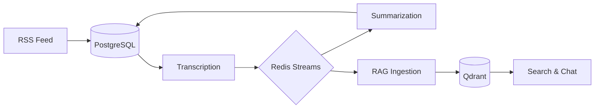

# Automated Podcast Transcription & RAG System

A modular, production-ready system for automated podcast transcription with speaker diarization and semantic search powered by RAG (Retrieval-Augmented Generation).

## 🎯 Overview

This monorepo contains four integrated services:

1. **Transcription Service**: Downloads and transcribes podcasts using WhisperX + Pyannote
2. **RAG Service**: Provides semantic search and Q&A over transcripts using Ollama (qwen3:rag)
3. **Summarization Service**: Generates structured summaries using local Ollama (qwen3:summarizer) or Gemini
4. **Frontend**: React-based web UI for managing podcasts and viewing results

## ✨ Features

### Transcription Service
- 🎙️ **Automatic RSS Feed Processing**: Subscribe to podcast feeds
- 🤖 **AI-Powered Transcription**: WhisperX with int8 quantization
- 👥 **Speaker Diarization**: Pyannote Audio for speaker identification
- 💾 **PostgreSQL Storage**: Central database for episodes, summaries, and transcripts
- 📋 **Redis Streams Queue**: Reliable, persistent job queue for transcription

### RAG Service  
- 🔍 **Semantic Search**: Vector-based transcript search with hybrid retrieval
- 💬 **AI Q&A**: Ask questions using local Ollama (qwen3:rag)
- 🔄 **Redis Streams Ingestion**: Reliable event-driven ingestion via consumer groups
- 🗃️ **Qdrant Vector DB**: Efficient similarity search with 768-dim embeddings
- 🧬 **BM25 + Vector Hybrid**: Best of both keyword and semantic search

### Summarization Service
- 📊 **Structured Summaries**: Local Ollama-powered episode summaries (qwen3:summarizer)
- 🎯 **Key Takeaways**: Hooks, actionable advice, quotes, and concepts
- 🔄 **Event-Driven**: Automatically processes new transcripts
- 💾 **JSON Storage**: Machine-readable structured output
- 🧪 **Gemini Support**: Optional high-quality alternative via API

### Frontend
- 🎨 **Modern React UI**: Fast, responsive interface
- 📚 **Library Management**: Browse episodes and summaries
- 💬 **RAG Chat**: Ask questions about any episode
- 📊 **Dashboard**: Queue management and transcription status
- 🔍 **Search & Filter**: Find episodes quickly

## 🏗️ Architecture

```
podcast-transcriber/
├── transcription-service/      # Podcast transcription
│   ├── src/
│   │   ├── cli.py             # CLI entry point
│   │   ├── worker_daemon.py   # Background worker
│   │   └── api/               # FastAPI implementation
│   ├── Dockerfile.api
│   └── README.md
│
├── rag-service/                # RAG backend (Ollama-powered)
│   ├── src/
│   │   ├── main.py            # FastAPI server
│   │   ├── services/          # RAG logic
│   │   └── event_subscriber   # Event-driven indexing
│   └── README.md
│
├── summarization-service/      # Summarization backend (Ollama/Gemini)
│   ├── src/
│   │   ├── main.py            # FastAPI server
│   │   └── services/          # Two-stage summarization
│   └── README.md
│
├── frontend/                   # React UI
│
├── models/                     # Ollama Modelfiles
│   ├── Modelfile_rag
│   └── Modelfile_sum
│
├── shared/                     # Shared resources
│   ├── podcast_transcriber_shared/ # Shared python library
│   ├── config/                # Configuration files
│   ├── output/                # Transcripts
│   └── logs/                  # Application logs
│
├── docs/                       # Project documentation
│   ├── archive/               # Historical documents
│   └── ...
│
├── docker-compose.yml          # Main orchestration
└── README.md                   # This file
```

## 🚀 Quick Start

### Prerequisites

- **OS**: Windows 10/11 (Linux/Mac compatible with minor changes)
- **Docker Desktop**: For running all services
- **Ollama**: For RAG/chat features
- **GPU** (Optional): NVIDIA GPU with 8GB+ VRAM for GPU-accelerated transcription
- **API Keys**: 
  - HuggingFace Token (for speaker diarization)
  - Google Gemini API Key (for summarization)

### 1. Clone Repository

```bash
git clone https://github.com/yourusername/podcast-transcriber.git
cd podcast-transcriber
```

### 2. Configure Environment

```bash
# Copy example configuration
cp .env.example .env

# Edit .env and add your API keys:
# - HUGGINGFACE_TOKEN (required for speaker diarization)
# - GEMINI_API_KEY (required for summarization)
```

### 3. Setup Ollama

```bash
# Install Ollama from: https://ollama.ai/download

# Pull base models
ollama pull qwen3:8b
ollama pull nomic-embed-text

# Create custom RAG model (optimized for 8GB VRAM)
# Create a file named 'Modelfile' with:
# FROM qwen3:8b
# PARAMETER num_ctx 6144
# PARAMETER temperature 0.6
# PARAMETER top_k 20
# PARAMETER top_p 0.95

ollama create qwen3:rag -f Modelfile
```

### 4. Create Docker Secrets

```bash
# Create secrets directory
mkdir secrets

# Add your Gemini API key to a file
echo "your_api_key_here" > secrets/gemini_api_key.txt
```

### 5. Start the Application

```bash
# Windows: Double-click start_app.bat or run:
start_app.bat

# This will:
# - Start all Docker services (Frontend, RAG, API, Summarization, Qdrant, Redis, PostgreSQL)
# - Start the host listener for transcription triggers
# - Open your browser to http://localhost:3000
```

### 6. Access the Application

- **Web UI**: http://localhost:3000
- **RAG API**: http://localhost:8000/docs
- **Transcription API**: http://localhost:8001/docs
- **Summarization API**: http://localhost:8002/docs

## 📚 Usage

### Adding Podcasts and Queueing Episodes

1. Open the web interface at http://localhost:3000
2. Navigate to **Feeds** tab
3. Add RSS feed URLs for your favorite podcasts
4. Click **Fetch Episodes** to see available episodes
5. Select episodes and click **Add to Queue**

### Transcribing Episodes

The transcription service runs automatically as a Docker container, processing queued episodes:

```bash
# View transcription worker logs
docker-compose logs -f transcription-worker

# Manually restart the worker if needed
docker-compose restart transcription-worker
```

**Note**: The transcription worker uses your GPU if available. See [GPU_SETUP.md](GPU_SETUP.md) for GPU configuration.

### Using RAG Chat

1. Navigate to **Library** tab
2. Click on any episode with a transcript
3. Use the **Chat** feature to ask questions about the content
4. The RAG service will search the transcript and provide AI-generated answers

## 🔧 Configuration

### Environment Variables

Create a `.env` file in the project root:

```bash
# Transcription Service
HUGGINGFACE_TOKEN=hf_your_token_here
DEVICE=cuda
COMPUTE_TYPE=int8
BATCH_SIZE=4
WHISPER_MODEL=large-v2

# RAG Service  
GEMINI_API_KEY=your_gemini_api_key
QDRANT_URL=http://localhost:6333
EMBEDDING_MODEL=all-MiniLM-L6-v2
```

### HuggingFace Setup (Required for Diarization)

1. Create account at [huggingface.co](https://huggingface.co)
2. Accept licenses:
   - [pyannote/segmentation-3.0](https://huggingface.co/pyannote/segmentation-3.0)
   - [pyannote/speaker-diarization-3.1](https://huggingface.co/pyannote/speaker-diarization-3.1)
3. Get access token from settings
4. Add to `.env` as `HUGGINGFACE_TOKEN`

## 📦 Service Details

### Transcription Service

**Tech Stack:**
- WhisperX (transcription)
- Pyannote Audio (diarization)
- PostgreSQL (state management)
- Redis Streams (job queue)
- PyTorch + CUDA

**See:** [transcription-service/README.md](transcription-service/README.md)

### RAG Service

**Tech Stack:**
- FastAPI (API server)
- Qdrant (vector database)
- PostgreSQL (metadata storage)
- Redis Streams (event subscriber)
- Ollama (LLM and embeddings)
- Hybrid Search (BM25 + Vector)

**See:** [rag-service/README.md](rag-service/README.md)

### Summarization Service

**Tech Stack:**
- FastAPI (API server)
- PostgreSQL (summary storage)
- Redis Streams (reliable event handling)
- Local Ollama (qwen3:summarizer) or Google Gemini
- Instructor (for structured data extraction)

**See:** [summarization-service/README.md](summarization-service/README.md)

## 🎨 Web Interface Features

- **📚 Library**: Browse all transcribed episodes with summaries
- **📊 Dashboard**: View queue status and manage transcription jobs
- **📡 Feed Management**: Add/remove podcast RSS feeds
- **💬 RAG Chat**: Ask questions about episode content
- **🔍 Search & Filter**: Find episodes quickly by title, podcast, or date

## 🔄 Workflow



## ⚡ Performance

**Transcription (RTX 3070, Docker):**
- 10-min episode: ~2-3 minutes
- 30-min episode: ~6-8 minutes  
- 60-min episode: ~12-15 minutes

**RAG (Ollama with qwen3:rag):**
- Embedding: ~1-2 seconds per episode
- Hybrid search: ~100-200ms
- Q&A response: 2-5 seconds

**Summarization (Gemini API):**
- Summary generation: 5-10 seconds per episode

## 🧪 Testing

```bash
# Syntax validation
python validate_syntax.py

# Run tests (when implemented)
cd transcription-service
pytest tests/

cd ../rag-service
pytest tests/
```

## 📚 Documentation

- [Quick Start Guide](QUICKSTART.md)
- [Transcription Service README](transcription-service/README.md)
- [RAG Service README](rag-service/README.md)
- [Summarization Service README](summarization-service/README.md)
- [Event Bus Architecture](docs/architecture/event_bus.md)
- [GPU Setup Guide](GPU_SETUP.md)
- [Historical Documentation](docs/archive/history/README.md)

## 🛠️ Development

### Code Structure

Each service follows clean architecture:
- **Modular design**: Clear separation of concerns
- **Type safety**: Type hints throughout
- **Configuration injection**: Testable components
- **Comprehensive documentation**: Inline docs and READMEs

### Contributing

See individual service READMEs for development guidelines.

## 🐛 Troubleshooting

### Transcription Service

**CUDA Out of Memory:**
- Reduce `BATCH_SIZE` in `.env`
- Use smaller model: `WHISPER_MODEL=medium`
- Close other GPU applications

**Import Errors:**
- Ensure conda environment is activated
- Run from project root directory

### RAG Service

**Qdrant Connection Error:**
- Verify Docker container is running
- Check `QDRANT_URL` in `.env`

**Gemini API Error:**
- Verify `GEMINI_API_KEY` is valid
- Check API quota/rate limits

## 📝 License

MIT License - See [LICENSE](LICENSE)

## 🙏 Acknowledgments

- [WhisperX](https://github.com/m-bain/whisperx) - Fast speech recognition
- [Pyannote Audio](https://github.com/pyannote/pyannote-audio) - Speaker diarization
- [Ollama](https://ollama.ai/) - Local LLMs and embeddings
- [Qdrant](https://qdrant.tech/) - Vector database
- [PostgreSQL](https://www.postgresql.org/) - Relational database
- [Google Gemini](https://deepmind.google/technologies/gemini/) - LLM & embeddings (optional)
