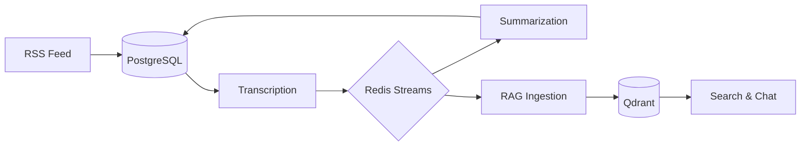

# Automated Podcast Transcription & RAG System

A modular, production-ready system for automated podcast transcription with speaker diarization and semantic search powered by RAG (Retrieval-Augmented Generation).

## 🎯 Overview

This monorepo contains five integrated services:

1. **Transcription API**: FastAPI for managing RSS feeds and transcription queue.
2. **Transcription Worker**: Background worker that processes audio using WhisperX + Pyannote, coordinated via Redis Streams.
3. **RAG Service**: Provides hybrid semantic search (BM25 + Qdrant) and streaming Q&A using local Ollama (`qwen3:rag`).
4. **Summarization Service**: Generates structured summaries using a two-stage Map-Reduce Synthesis pipeline with local Ollama (`qwen3:summarizer`).
5. **Frontend**: React-based "Unified Intelligence & Navigation Interface" (UII) for managing podcasts and interactive "Search-to-Seek" results.

## ✨ Features

### Transcription Pipeline
- 🎙️ **Automatic RSS Feed Processing**: Subscribe to podcast feeds and sync episodes.
- 📋 **Queue Management**: API endpoints for managing the transcription queue with SQL Source of Truth.
- 🐳 **Worker Daemon**: Long-running background worker using Redis Streams for reliable job handling.
- ⚡ **GPU Optimized**: NVIDIA GPU acceleration with Distributed GPU Lock and "Immediate Release" strategy.
- 👥 **Speaker Diarization**: Pyannote Audio for high-accuracy speaker identification.

### RAG Service (Search & Chat)
- 🔍 **Hybrid Search**: Reciprocal Rank Fusion (RRF) combining BM25 keyword search and Qdrant vector similarity.
- 💬 **Streaming Q&A**: Real-time answer generation via Ollama with protocol-defined metadata (sources/timestamps).
- 🔄 **Redis Streams Ingestion**: Reliable event-driven ingestion with deterministic UUIDs for idempotency.
- 🗃️ **Qdrant Vector DB**: Efficient similarity search with 768-dim embeddings (`nomic-embed-text`).
- 🔗 **Search-to-Seek**: Interactive citations that navigate the UI to specific audio timestamps.

### Summarization Service
- 🗺️ **Map-Reduce Synthesis**: Two-stage pipeline (Thinker/Structurer) for high-fidelity summaries of long transcripts.
- 🧬 **Rolling State Refinery**: Maintains narrative context across chunk boundaries during synthesis.
- 🛡️ **VRAM Guard**: Active memory management and garbage collection during deep inference.
- 💾 **Structured Extraction**: Instructor-powered extraction for guaranteed JSON schema validation.
- 📊 **Rich Metadata**: Captures key topics, takeaways, notable quotes, and processing metrics.

### Frontend (UII)
- 🎨 **Unified Interface**: Single, high-performance streaming hook for all chat and search experiences.
- 📱 **Responsive Design**: Modern React UI with real-time status monitoring.
- 📊 **Pipeline Dashboard**: Visibility into worker status, heartbeats, and queue health.
- 🔍 **Global vs Episode Search**: Visual indicators for search scope and context.

## 🏗️ Architecture

```
podcast-transcriber/
├── transcription-service/      # API and Worker Daemon
│   ├── src/
│   │   ├── worker_daemon.py   # Long-running worker entry point
│   │   └── api/               # FastAPI management endpoints
│   ├── Dockerfile.api         # For transcription-api container
│   ├── Dockerfile.transcription-worker # For worker container
│   └── README.md
│
├── rag-service/                # RAG backend (Hybrid Search + Streaming)
│   ├── src/
│   │   ├── main.py            # FastAPI server
│   │   ├── event_subscriber.py # Redis Stream consumer
│   │   └── services/          # Hybrid retriever logic
│   └── README.md
│
├── summarization-service/      # Summarization backend (Map-Reduce)
│   ├── src/
│   │   ├── main.py            # FastAPI server
│   │   ├── event_subscriber.py # Redis Stream consumer
│   │   └── services/          # Two-stage summarization logic
│   └── README.md
│
├── frontend/                   # React UII (Unified Intelligence Interface)
│
├── models/                     # Ollama Modelfiles
│   ├── Modelfile_rag
│   └── Modelfile_sum
│
├── shared/                     # Shared resources
│   ├── podcast_transcriber_shared/ # Core shared logic (DB, Events, GPU Lock)
│   ├── config/                # Prompt templates and yaml config
│   ├── output/                # Shared transcript storage
│   └── logs/                  # Unified logging
│
├── docs/                       # Project documentation
│   ├── architecture/          # Design docs (Event Bus, API Contracts)
│   └── archive/               # Historical context
│
├── docker-compose.yml          # Main orchestration (Multi-service)
└── README.md                   # This file
```

## 🚀 Quick Start

### Prerequisites

- **OS**: Windows 10/11 (Linux/Mac compatible with minor changes)
- **Docker Desktop**: For running all services
- **Ollama**: For RAG/chat features
- **GPU** (Optional): NVIDIA GPU with 8GB+ VRAM for GPU-accelerated transcription
- **API Keys**: 
  - HuggingFace Token (required for speaker diarization)

### 1. Clone Repository

```bash
git clone https://github.com/yourusername/podcast-transcriber.git
cd podcast-transcriber
```

### 2. Configure Environment

```bash
# Copy example configuration
cp .env.example .env

# Edit .env and add your API keys:
# - HUGGINGFACE_TOKEN (required for speaker diarization)
# - GEMINI_API_KEY (required for summarization)
```

### 3. Setup Ollama

```bash
# Install Ollama from: https://ollama.ai/download

# Pull base models
ollama pull qwen3:8b
ollama pull nomic-embed-text:latest

# Create custom models from project Modelfiles
ollama create qwen3:rag -f models/Modelfile_rag
ollama create qwen3:summarizer -f models/Modelfile_sum
```

### 4. Configure Environment

Edit `.env` and add your HuggingFace token (required for speaker diarization).

### 5. Start the Application

```bash
# Windows: Double-click start_app.bat or run:
start_app.bat

# This will:
# - Start all Docker services (Frontend, RAG, Transcription API, Transcription Worker, Summarization, Qdrant, Redis, PostgreSQL)
# - Start the host listener for transcription triggers
# - Open your browser to http://localhost:3000
```

### 6. Access the Application

- **Web UI**: http://localhost:3000
- **RAG API**: http://localhost:8000/docs
- **Transcription API**: http://localhost:8001/docs
- **Summarization API**: http://localhost:8002/docs

## 📚 Usage

### Adding Podcasts and Queueing Episodes

1. Open the web interface at http://localhost:3000
2. Navigate to **Feeds** tab
3. Add RSS feed URLs for your favorite podcasts
4. Click **Fetch Episodes** to see available episodes
5. Select episodes and click **Add to Queue**

### Transcribing Episodes

The transcription service runs automatically as a Docker container, processing queued episodes:

```bash
# View transcription worker logs
docker-compose logs -f transcription-worker

# Manually restart the worker if needed
docker-compose restart transcription-worker
```

**Note**: The transcription worker uses your GPU if available. See [GPU_SETUP.md](GPU_SETUP.md) for GPU configuration.

### Using RAG Chat

1. Navigate to **Library** tab
2. Click on any episode with a transcript
3. Use the **Chat** feature to ask questions about the content
4. The RAG service will search the transcript and provide AI-generated answers

## 🔧 Configuration

### Environment Variables

Create a `.env` file in the project root:

```bash
# Transcription Service
HUGGINGFACE_TOKEN=hf_your_token_here
DEVICE=cuda
COMPUTE_TYPE=int8
BATCH_SIZE=4
WHISPER_MODEL=large-v2

# RAG Service  
QDRANT_URL=http://localhost:6333
EMBEDDING_MODEL=nomic-embed-text
EMBEDDING_DIMENSION=768
```

### HuggingFace Setup (Required for Diarization)

1. Create account at [huggingface.co](https://huggingface.co)
2. Accept licenses:
   - [pyannote/segmentation-3.0](https://huggingface.co/pyannote/segmentation-3.0)
   - [pyannote/speaker-diarization-3.1](https://huggingface.co/pyannote/speaker-diarization-3.1)
3. Get access token from settings
4. Add to `.env` as `HUGGINGFACE_TOKEN`

## 📦 Service Details

### Transcription API & Worker

**Tech Stack:**
- WhisperX (transcription) - Worker
- Pyannote Audio (diarization) - Worker
- FastAPI (API server) - API
- PostgreSQL (state management)
- Redis Streams (job queue)
- PyTorch + CUDA

**See:** [transcription-service/README.md](transcription-service/README.md)

### RAG Service

**Tech Stack:**
- FastAPI (API server with streaming support)
- Qdrant (vector database)
- PostgreSQL (metadata storage)
- Redis Streams (event-driven ingestion)
- Ollama (LLM: `qwen3:rag`, Embeddings: `nomic-embed-text`)
- Hybrid Search (BM25 + Vector RRF)

**See:** [rag-service/README.md](rag-service/README.md)

### Summarization Service

**Tech Stack:**
- FastAPI (API server)
- PostgreSQL (summary storage)
- Redis Streams (reliable event handling)
- Local Ollama (`qwen3:summarizer`)
- Map-Reduce Synthesis (Two-stage Thinking/Structuring)
- Instructor (for structured data extraction)

**See:** [summarization-service/README.md](summarization-service/README.md)

## 🎨 Web Interface Features

- **📚 Library**: Browse all transcribed episodes with summaries
- **📊 Dashboard**: View queue status and manage transcription jobs
- **📡 Feed Management**: Add/remove podcast RSS feeds
- **💬 RAG Chat**: Ask questions about episode content
- **🔍 Search & Filter**: Find episodes quickly by title, podcast, or date

## 🔄 Workflow



## ⚡ Performance

**Transcription (RTX 3070, Docker):**
- 10-min episode: ~2-3 minutes
- 30-min episode: ~6-8 minutes  
- 60-min episode: ~12-15 minutes

**RAG (Ollama with qwen3:rag):**
- Embedding: ~1-2 seconds per episode
- Hybrid search: ~100-200ms
- Q&A response: 2-5 seconds

**Summarization (Gemini API):**
- Summary generation: 5-10 seconds per episode

## 🧪 Testing

```bash
# Syntax validation
python validate_syntax.py

# Run tests (when implemented)
cd transcription-service
pytest tests/

cd ../rag-service
pytest tests/
```

## 📚 Documentation

- [Quick Start Guide](QUICKSTART.md)
- [Transcription Service README](transcription-service/README.md)
- [RAG Service README](rag-service/README.md)
- [Summarization Service README](summarization-service/README.md)
- [Event Bus Architecture](docs/architecture/event_bus.md)
- [GPU Setup Guide](GPU_SETUP.md)
- [Historical Documentation](docs/archive/history/README.md)

## 🛠️ Development

### Code Structure

Each service follows clean architecture:
- **Modular design**: Clear separation of concerns
- **Type safety**: Type hints throughout
- **Configuration injection**: Testable components
- **Comprehensive documentation**: Inline docs and READMEs

### Contributing

See individual service READMEs for development guidelines.

## 🐛 Troubleshooting

### Transcription Service

**CUDA Out of Memory:**
- Reduce `BATCH_SIZE` in `.env`
- Use smaller model: `WHISPER_MODEL=medium`
- Close other GPU applications

**Import Errors:**
- Ensure conda environment is activated
- Run from project root directory

### RAG Service

**Qdrant Connection Error:**
- Verify Docker container is running
- Check `QDRANT_URL` in `.env`

**Gemini API Error:**
- Verify `GEMINI_API_KEY` is valid
- Check API quota/rate limits

## 📝 License

MIT License - See [LICENSE](LICENSE)

## 🙏 Acknowledgments

- [WhisperX](https://github.com/m-bain/whisperx) - Fast speech recognition
- [Pyannote Audio](https://github.com/pyannote/pyannote-audio) - Speaker diarization
- [Ollama](https://ollama.ai/) - Local LLMs and embeddings
- [Qdrant](https://qdrant.tech/) - Vector database
- [PostgreSQL](https://www.postgresql.org/) - Relational database
- [Google Gemini](https://deepmind.google/technologies/gemini/) - LLM & embeddings (optional)
