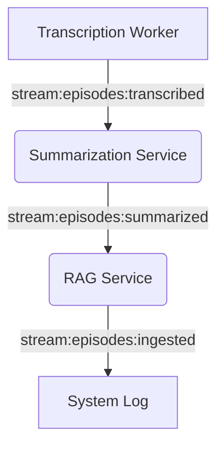

# Event Bus Architecture (Redis Streams)

## Overview

The Podcast Transcriber uses an event-driven architecture to coordinate between decoupled services. The system has migrated from Redis Pub/Sub to **Redis Streams** to provide reliable messaging, persistence, and consumer group support.

## Key Principles

### 1. Path Consistency ⚠️
**CRITICAL**: All Docker services MUST mount shared directories at identical container paths.

| Host Path | Container Path | Purpose |
|-----------|----------------|---------|
| `./shared/output` | `/app/shared/output` | Transcripts and audio |
| `./shared/summaries` | `/app/shared/summaries` | Generated summaries |
| `./shared/config` | `/app/shared/config` | Shared configuration |
| `./shared/logs` | `/app/shared/logs` | Service logs |

**Why it matters**: Events contain file paths. If paths are inconsistent, a service receiving an event won't be able to find the referenced file.

### 2. Reliable Messaging (Redis Streams)
Unlike Pub/Sub, Redis Streams are persistent.
- **Consumer Groups**: Ensures each event is processed even if a service is temporarily down.
- **Acknowledgements (ACK)**: Events are only removed from the "pending" state once the consumer acknowledges successful processing.
- **Pending Message Resumption**: On startup, services check for and process any messages they previously received but didn't ACK.

### 3. Idempotency
Services check for existing work before processing to prevent duplicates:
- **RAG Service**: Checks Qdrant for existing `episode_id` before indexing.
- **Summarization Service**: Checks the database for an existing summary before generating a new one.

## Event Flow



## Implementation Details

The core logic resides in `shared/podcast_transcriber_shared/events.py`.

### Publishing
```python
await event_bus.publish(event_bus.STREAM_TRANSCRIBED, event)
```

### Subscribing
```python
await event_bus.subscribe(
    stream=event_bus.STREAM_SUMMARIZED,
    group_name="rag_service_group",
    consumer_name="rag_worker_1",
    callback=process_summary_event
)
```

## Troubleshooting

1. **Check Redis Streams**:
   ```bash
   # From inside the redis container
   redis-cli XINFO STREAM stream:episodes:transcribed
   redis-cli XINFO GROUPS stream:episodes:transcribed
   ```
2. **View Logs**: Check service logs for "Resuming pending event" or "Published event".
3. **Verify Paths**: Ensure volume mounts in `docker-compose.yml` match the table above.
